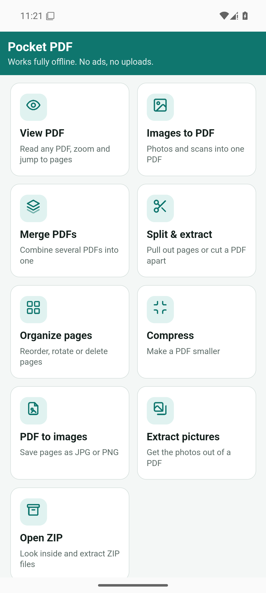
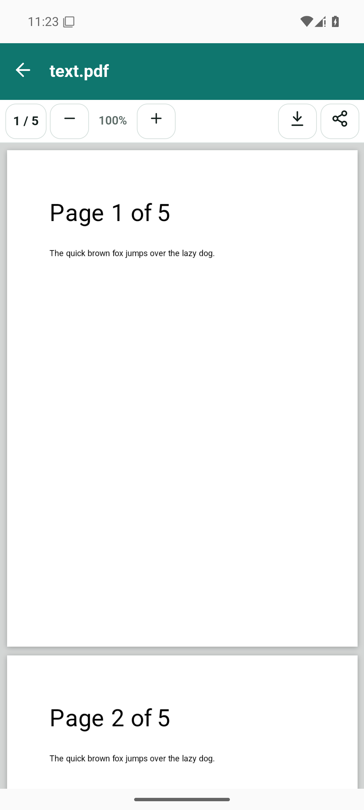
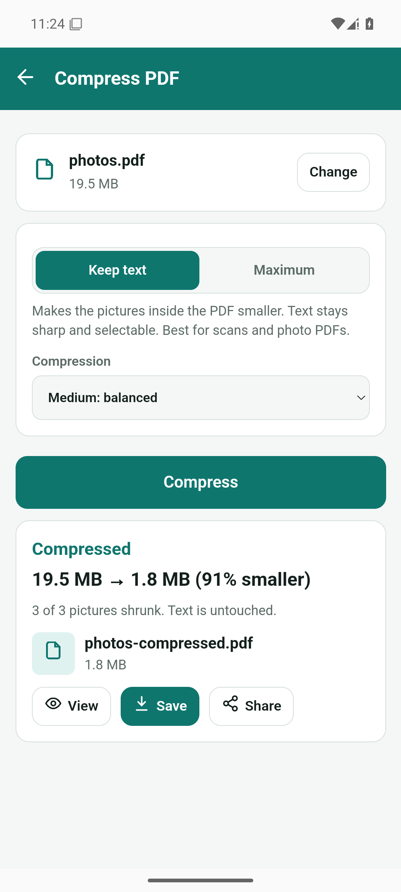
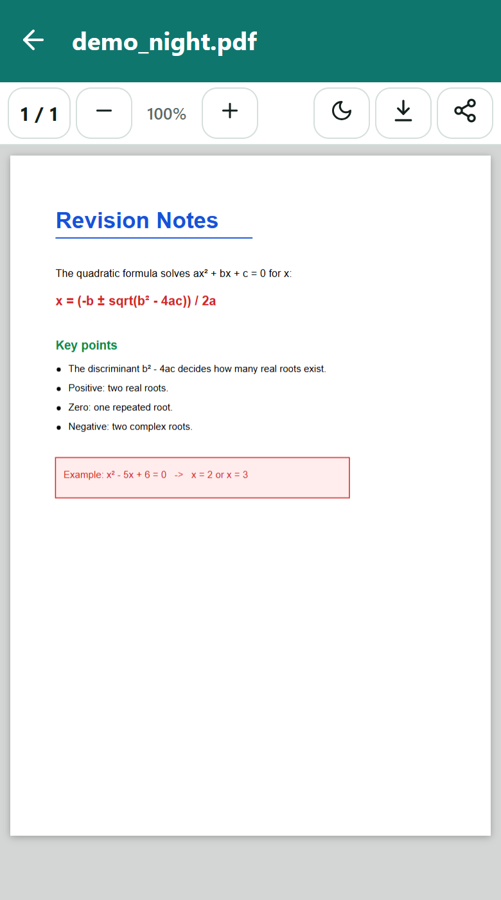
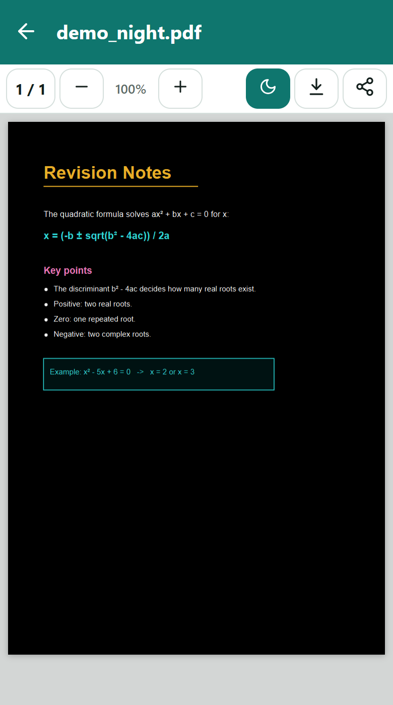
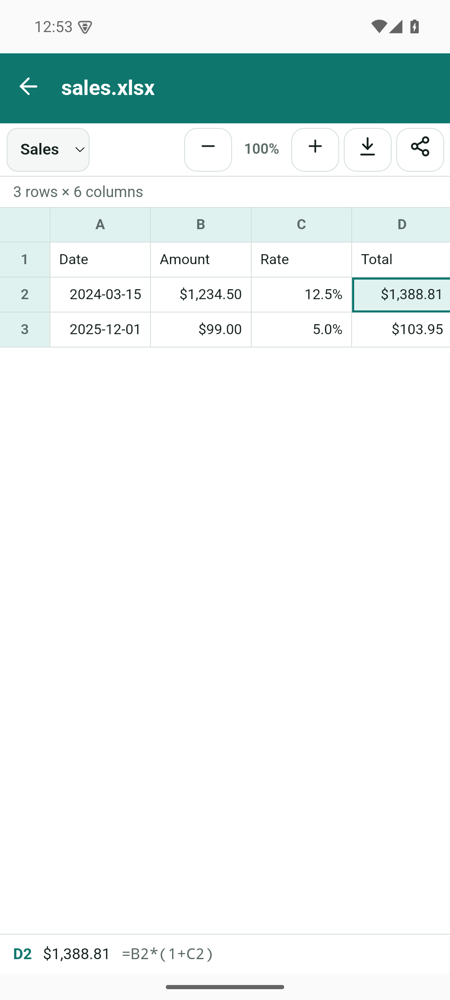
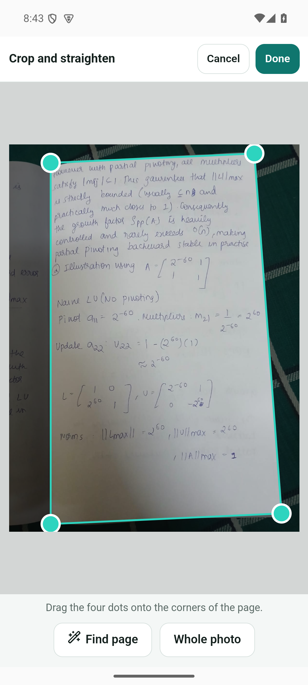
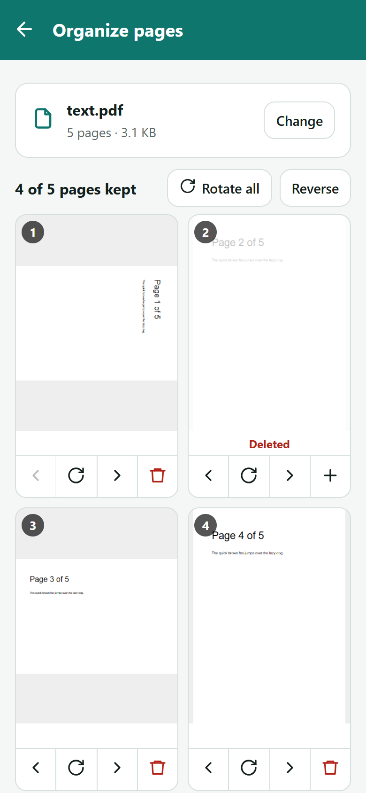
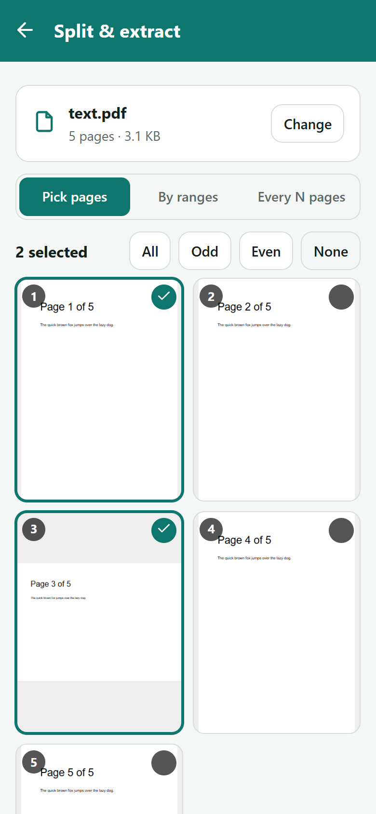
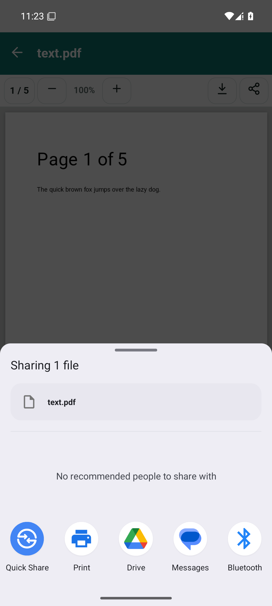

# No Ads PDF

**A free Android PDF toolkit with no ads, no sign-up and no internet access.**
View, merge, split, compress and convert PDFs, turn photos into PDFs, open Excel and CSV files, and open ZIP files, all on your phone.

The app is called **Pocket PDF** on your phone. This repository is *no-ads-pdf*.

<p align="center">
  
  
  
</p>

## Why this exists

Most free "image to PDF" and "open ZIP" apps are covered in ads and want your files uploaded to a server.
This one runs entirely on your phone. It has **no internet permission at all**, so it *cannot* send your
documents anywhere, and there is nothing to show you ads with.

## Download and install

1. On your phone, open the **[latest release](../../releases/latest)** and download **`PocketPDF.apk`**.
2. Open the downloaded file. Android will say *"For your security, your phone isn't allowed to install unknown apps from this source"*.
   Tap **Settings**, switch on **Allow from this source**, go back, and tap **Install**.
3. Open **Pocket PDF**.

Needs **Android 10 or newer**. Nothing else to set up, no account and no permissions to grant.

> The APK is signed with a personal debug key, not the Play Store. Android may show a "Play Protect" notice; choose **Install anyway**.
> Because there's no Play Store, updates are manual: download the newer APK and install it over the old one.

## How to use it

Open the app and tap a tool. Every tool works the same way: **choose a file, adjust, tap the big button, then Save or Share.**
Saved files go to **Downloads → Pocket PDF**, and the "Saved…" message has an **Open** button. The back arrow (or your phone's back gesture) always takes you one step back.

### View PDF
Tap **View PDF**, choose a file, and read it. Scroll to move through pages, **pinch** or use **+ / −** to zoom, and tap the page counter (like `3 / 12`) to jump to a page.
Password-protected PDFs ask for the password (it stays on your phone).
The moon button turns on **night mode**, which inverts every page (white becomes black, and every colour flips to its opposite) so reading in the dark doesn't light up the room. It's remembered for next time. Photos and coloured diagrams inside the PDF invert too, so they'll look like a negative.
The buttons at the top right save a copy or share the file.

<p align="center">
  
  
</p>

### View Excel
Tap **View Excel**, choose a spreadsheet (`.xlsx`, `.xls`, `.csv`, `.ods`), and read it. Dates, currency and percentages look the way they do in Excel.
Use the dropdown at the top to switch between sheets (hidden sheets stay hidden), **+ / −** to zoom, and **tap any cell** to see its full text and formula at the bottom of the screen.
Big sheets load as you scroll, so a 50,000-row file won't freeze your phone. It's view-only: you can't edit or save changes, but the buttons at the top right save or share the original file.

<p align="center">
  
</p>

### Images to PDF
1. Tap **Choose images** (several at once) or **Take photo** for scanning paper documents.
2. **Auto-crop pages** (on by default) finds the sheet of paper in each photo, cuts away the table or cloth behind it, and straightens it, like a scanner app. Photos that are already just a page are left alone. Those it cropped get a **Cropped** badge.
3. **Tap a picture** to see it full screen. **Swipe** left or right to go through the pages. From there you can **Crop**, **Rotate**, **Save** the page as a JPG, or **Remove** it. **Show full photo** compares the crop with the original.
   The buttons under each picture do the same quickly: arrows to reorder, **↻** to rotate, **✕** to remove. Tap **+ Add** for more.
4. Pick a page size (A4, Letter, or same as the image), margin and quality, and give the file a name.
5. Tap **Create PDF**.

**If the crop isn't quite right**, tap the crop icon under the picture and drag the four dots onto the corners of the page. **Find page** puts the dots back where the app thinks the edges are, and **Whole photo** removes the crop. Your original photo is never changed.

Notebook photos work too: if you photographed an open notebook, it keeps just the page you're writing on and drops the facing page.

<p align="center">
  
</p>

Photos taken sideways on your phone come out the right way up, and transparent PNGs get a white background.

### Merge PDFs
Choose two or more PDFs, move them **up or down** into the order you want, name the result, and tap **Merge PDFs**.

### Split & extract
Choose a PDF, then pick a mode:
- **Pick pages:** tap the pages you want (or use **All / Odd / Even / None**) and tap **Extract**. You get one new PDF.
- **By ranges:** type ranges like `1-3, 4-6, 7-`. Each range becomes its own PDF. A dash at the end means "to the last page".
- **Every N pages:** for example every 2 pages gives a 10-page PDF as five 2-page PDFs.

When you get several files, use **Save all** (they go into their own folder), **Save as ZIP** or **Share all**.

### Organize pages
Choose a PDF and fix it visually. Each page has **←  ↻  →  🗑** buttons to move it earlier or later, rotate it, or delete it (tap again to restore). **Rotate all** and **Reverse** are at the top. Tap **Save new PDF** when you're done.

<p align="center">
  
  
</p>

### Compress
Choose a PDF, pick a mode and a strength, and tap **Compress**. You'll see the before and after size.
- **Keep text** (default): shrinks the photos and scans inside the PDF. Text stays sharp and selectable. Best for scanned documents and PDFs full of pictures. A 19.5 MB photo PDF became 1.8 MB in testing.
- **Maximum:** turns every page into a picture for the smallest possible file. Text can no longer be selected or searched. Use it when "Keep text" isn't small enough.

If a PDF is mostly text there's little to shrink, and the app tells you so instead of pretending.

### PDF to images
Choose a PDF, pick **JPG** (smaller) or **PNG** (sharpest), a resolution, and optionally which pages (leave blank for all, or type `2-4, 7`). Tap **Convert**, then save one image or all of them.

### Extract pictures
Finds every photo embedded in a PDF and saves it at its original size. Tap **Find pictures**, deselect any you don't want, and tap **Get images**.
"Smallest picture" hides icons and decorations.

### Open ZIP
Choose a ZIP file to browse what's inside. Search by name, tap **View** to preview images, text, audio, video and PDFs, or **Save** a single file.
Tick several and **Save** or **Share** them, or tap **Extract all**, which recreates the original folders under **Downloads → Pocket PDF → *zip name***.

### Open files from other apps
Pocket PDF appears in Android's **Open with** list for PDFs, Excel/CSV files and ZIPs, so you can open one straight from WhatsApp, Gmail or the Files app. Choose **Always** to make it your default PDF viewer.

<p align="center">
  
</p>

## Questions

**Where are my files saved?** In **Downloads → Pocket PDF**. Open your Files app, then Downloads.

**Is it really private?** Yes. The app asks for no permissions: no internet, no storage, no camera access. Android itself blocks it from going online, and it only sees files you pick yourself.

**The auto-crop cut the wrong part.** It works best when the page is lighter than what's behind it. On a white desk or a very dark, dim photo it may not find the edges. Tap the crop icon and drag the four dots, or switch **Auto-crop pages** off.

**Why does my spreadsheet show old numbers or no charts?** The viewer shows the values saved in the file (formulas aren't recalculated), and it doesn't draw charts, images or cell colors. Merged cells show their text in the first cell. Password-protected spreadsheets can't be opened.

**Why can't I edit a password-protected PDF?** You can read it, but merging, splitting, compressing and so on need the file unlocked. Removing passwords isn't built yet.

**A big PDF failed or the app got slow.** Phones have limited memory. Try Compress → Maximum, split the PDF into parts first, or close other apps.

**Can I get it on iPhone?** Not as an app. iPhone apps need a Mac and a paid Apple developer account. The web code in `www/` runs in any browser, though.

## Build it yourself

You need Windows with PowerShell, Node.js, Java 21 and the Android SDK.

```powershell
git clone https://github.com/aithal007/no-ads-pdf.git
cd no-ads-pdf
npm install
npm run libs        # copies pdf.js, pdf-lib, fflate, SheetJS and Capacitor into www/lib
.\build-apk.ps1     # builds PocketPDF.apk next to the script
```

`build-apk.ps1` expects Node.js and the Android SDK in `%USERPROFILE%\dev-tools` (`node` and `android-sdk` folders) and Java 21 in `C:\Program Files\Eclipse Adoptium`. Edit the paths at the top of the script if yours are elsewhere.

To try changes quickly without a phone, serve `www/` from any local web server (for example `python -m http.server` inside `www/`) and open it in a browser. Saving files then downloads them normally.

### How it's built
- `www/`: the whole app, plain HTML, CSS and JavaScript with no build step.
  `js/core.js` holds shared helpers, `js/tool-*.js` is one file per tool, `js/main.js` is the home screen and Android hooks.
- `android/`: the Android wrapper ([Capacitor](https://capacitorjs.com/)).
  `PocketFilesPlugin.java` saves files to Downloads, shares them, and reads PDFs opened from other apps.
- Libraries: [pdf-lib](https://pdf-lib.js.org/) (editing PDFs), [pdf.js](https://mozilla.github.io/pdf.js/) (drawing pages), [fflate](https://github.com/101arrowz/fflate) (ZIP), [SheetJS](https://sheetjs.com/) (Excel and CSV).

## Not built yet

Password lock and unlock, watermarks, page numbers, signing and filling forms, annotations and highlighting, OCR, text search inside the viewer, and editing spreadsheets. Ideas and bug reports are welcome under **Issues**.

## Credits

Built with the open-source libraries above: pdf-lib (MIT), pdf.js (Apache-2.0), fflate (MIT), SheetJS Community Edition (Apache-2.0) and Capacitor (MIT).
